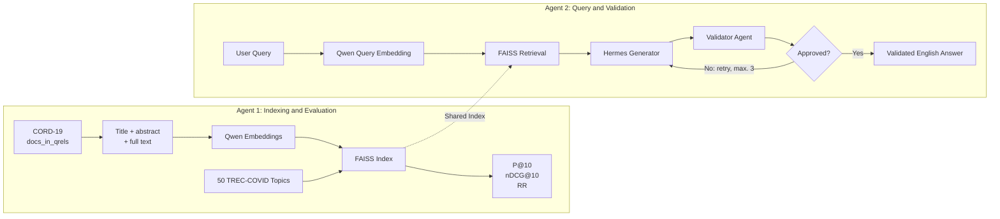

# CORD-19 Multi-Agent RAG

Local scientific RAG system using:

- **Dataset:** CORD-19 / TREC-COVID
- **Embeddings:** `Qwen/Qwen3-Embedding-0.6B`
- **Vector search:** FAISS
- **Generator:** `NousResearch/Hermes-4.3-36B`
- **Validator:** configurable OpenAI-compatible model
- **Interface:** Gradio

## Architecture



## Workflow

### Agent 1: Indexing

```text
CORD-19
   |
docs_in_qrels
   |
Qwen embeddings
   |
FAISS index
```

The current persistent index contains **37,924 documents**:

```text
hackathon/qwen.index
hackathon/qwen.index.vect
```

### Agent 2: Query

```text
User question
   |
Qwen query embedding
   |
FAISS retrieval
   |
Hermes answer
   |
Validator
   |
Final answer
```

If validation fails, Hermes regenerates the answer using the validator's
feedback. The default limit is three attempts.

## Installation

```bash
cd /path/to/ol2a
python -m venv .venv
source .venv/bin/activate
python -m pip install -r requirements.txt
```

Use the local Hugging Face cache:

```bash
export HF_HOME="$PWD/.hf_cache"
export HF_HUB_OFFLINE=1
export TRANSFORMERS_OFFLINE=1
```

## Run the Application

```bash
python gradio_app.py \
  --device cpu \
  --bind-host 0.0.0.0 \
  --server-name auto \
  --server-port 7869
```

Open:

```text
http://HOST_IP:7869
```

For a specific IP:

```bash
python gradio_app.py \
  --device cpu \
  --bind-host 0.0.0.0 \
  --server-name HOST_IP \
  --server-port 7869
```

## Test the Index

```bash
python hackathon/query_qwen_index.py \
  "What evidence is available about coronavirus transmission?" \
  --device cpu \
  --top-k 5
```

## Retrieval Evaluation

Run the 50 official TREC-COVID topics:

```bash
python main_dd.py --device cpu
```

Current results:

| Metric | Value |
|---|---:|
| P@10 | 0.778000 |
| nDCG@10 | 0.740241 |
| RR | 0.898667 |

Quick test with one topic:

```bash
python main_dd.py \
  --device cpu \
  --max-queries 1 \
  --skip-eval \
  --output out_test.txt
```

## Build a Small Test Index

This creates a separate chunk-based index from 500 title-and-abstract
documents:

```bash
python main.py \
  --source ir_datasets \
  --dataset-name cord19/fulltext/trec-covid \
  --docs-mode docs_in_qrels \
  --content-mode abstract_title \
  --max-docs 500 \
  --device cpu \
  --batch-size 1 \
  --index-batch-size 32 \
  --output-dir vector_store_test
```

Use `--device cuda` when sufficient GPU memory is available.

> The index created by `main.py` has a different format from
> `hackathon/qwen.index` and is not currently used by Gradio.

## Main Files

| File | Purpose |
|---|---|
| `gradio_app.py` | Web interface and complete RAG flow |
| `rag_utils.py` | Embeddings, context, Hermes, and validation |
| `main.py` | Streaming chunk-index builder |
| `main_dd.py` | TREC-COVID evaluation command |
| `retrieval_evaluation.py` | Shared evaluation and metrics |
| `hackathon/qwen_store.py` | Persistent Qwen/FAISS search backend |
| `hackathon/qwen.index` | FAISS index |
| `hackathon/qwen.index.vect` | Serialized vectorizer |

## Configuration

```text
--device cpu|cuda|auto
--top-k N
--llm-base-url URL
--llm-model MODEL
--validator-base-url URL
--validator-model MODEL
--validation-attempts N
--server-port PORT
```

Example LLM configuration:

```text
URL:   http://LLM_SERVER:PORT/v1
Model: NousResearch/Hermes-4.3-36B
```


